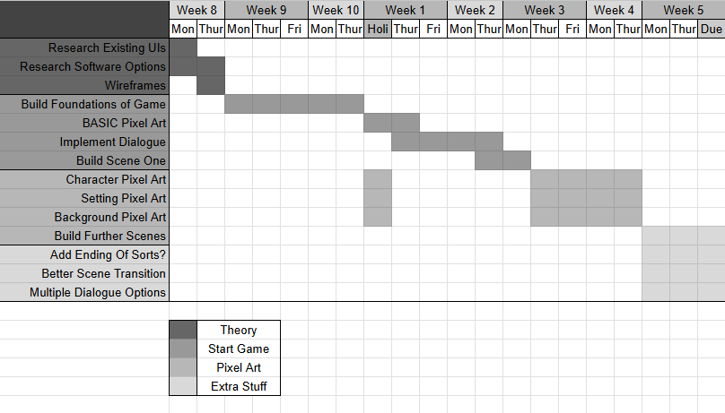

# 10CT Task 1
## Project Proposal
### 1 - Design Brief
I am developing a website based on the novel: *The Hobbit* by *JRR Tolkien*.  This website will be designed to introduce new fans to the basic info of the book, some characters as well as a map they can interact with.  

### 2 - Book Choice and Justification
Who hasn't heard of the hobbit? It is a book that everyone has heard of. It features a rich story, characters and world. However a lot of information out there can be full on. So, why not make a simplified version of a wiki page with less links to random characters you've never heard of.  

### 3 - User Experience Type
The user experience type will be a website, featuring different panels to take you to different locations on the website. You will be able to look up information on the author, the book itself, the characters, and view a map. This is aimed to increase an individual's general understanding of the book.  

### 4 - Target Market
This will be primarily focused towards new fans. The information will be relatively basic, aimed to help new fans understand a bit more about the book.  

### 5 - Software and Tools
I have two options. Adobe XD, or Figma. I've used Figma in the past and I didn't really like the design of the software. I also think Adobe XD is just overall better suited to this task.  

### 6 - Initial Brainstorming
Mindmap attached to hand in.

## Requirements Outline
### Functional Requirements
**Purpose of the Application**  
To let new users consume information from *'The Hobbit'*. Such as character info, info about the author and book, as well as a map they can click on to learn about different locations.  

**Use Cases**  
*Home Button* - The user will be able to click the home button from any page to return home.  
*Map Icons* - The user will be able to click on multiple location icons which will send them to info about that location.  
*Back Button* - From certain pages, users will be able to return to the previous screen.  
*Menu Buttons* - Users will be able to access all pages from anywhere. Meaning they don't have to go to home every time.  

**Test Cases**  
Each of these use cases will be tested the same way. Click every button from every location. It will absolutely be tedious, but it's the only way to ensure all the buttons work.  

### Non-Functional Requirements
**Performance**  
All the buttons should work. Yes that goes without saying, but it can be easy to miss a pathway or two. 

**Usability**  
It has to look nice. No one is gonna wanna use a boring, colourless website. so it is highly important I make it visually appealing.

**Reliability**  
The software is good, performs well and has no major issues.

**Security**  
This software will not collect any user data and therefore there are no security concerns.

## Social, Ethical and Legal Issues
### Social Impact
**Target Audience Considerations**  
People who want to read the hobbit or have just started and want to increase their general understanding of things.

**Potential Risks/Benefits**  
Well, I am dealing with a deeply loved series. People can be very critical when you mess with something beloved like this. Older fans also may nitpick the basic information, however it's aimed towards people that aren't experts of this series.

### Ethical Responsibilities
**User Data and Privacy**  
This software will not collect any user data and therefore there are no security concerns.  

### Non-Functional Requirements
**Performance**  
All the buttons should work. Yes that goes without saying, but it can be easy to miss a pathway or two. 

**Usability**  
It has to look nice. No one is gonna wanna use a boring, colourless website. so it is highly important I make it visually appealing.

**Reliability**  
The software is good, performs well and has no major issues.

**Security**  
This software will not collect any user data and therefore there are no security concerns.

## Social, Ethical and Legal Issues
### Social Impact
**Target Audience Considerations**  
People who want to read the hobbit or have just started and want to increase their general understanding of things.

**Potential Risks/Benefits**  
Well, I am dealing with a deeply loved series. People can be very critical when you mess with something beloved like this. Older fans also may nitpick the basic information, however its aimed towards people that arent experts of this series.

### Ethical Responsibilities
**User Data and Privacy**  
This software will not collect any user data, and therfore there are no security issues or concerns.

**Representation and Inclusion**  
I cant include sll the characters. If I had much more time Im sure I could continue to add them. However that isnt realistic for this project. Some people may get grumpy over the lack if their favourite character.

**Content Sensitivity**  
As far as I know, the book is fine. It is high fantasy, and largely avoids any controversial topics. It's a book made purely for enjoyment. As such, if people have issues with the content, they should just not use my software. There is one small aspect. There are no female characters in this book. HOWEVER, I do not feel like this takes away from the story or book whatsoever, and I didn't even think about it until it was mentioned. If people seriously have an issue with this, like I've said in the past, just don't use this software. Easy. But realistically, users need to realise that this book was written in 1937. Of course it's going to have outdated gender representation.

### Legal Considerations
**Copyright and Intellectual Preperty**  
First of all, yes there will be information sourced and characters sourced from the book. However, this is not for any monetary gain whatsoever and I am a student. 

**Terms Of Use**  
According to smartcopying.edu.au states that the use of copyright material is allowed for educational purposes. That and the fact that I am not using this for any monetary gain, there aren't realistically any concerns.

## Researching and Planning
### Gantt Chart

### PMI Table - Existing UIs

### PMI Table - Software Options

## Ongoing Evaluation
### Term 2 Week 2. 
**Outline your progress this week, including key tasks completed and any challenges you encountered.**
Week 1 had no CT lessons, so week 2 is the start of the term basically. I made pixel art designs for both Bilbo and Gandalf.

**Analyse the most important design or functionality decisions you made and justify your choices.**
I also made a google forms to get feedback on said designs, which was good to get done.

**Explain how you approached and resolved any difficulties or obstacles this week.**
Drawing characters is difficult and tedious. Also, dont really have any clue whatsoever of how I'm actually planning to get everything done.

**Evaluate your time management and workflow—what strategies were effective, and what could be improved?**
The theory work took all of term 1, leaving not much time to actually make the software.

**Outline your priorities for next week—what specific areas need further development or refinement?**
Honestly starting to consider switching to a website. Its probably more realistic to get done.

### Term 2 Week 3
**Outline your progress this week, including key tasks completed and any challenges you encountered.**
Wow did I get stuff done this week. So, basically shifted to a website. That was fun. The main design was fairly easy to set up and it was quite sucessful, everything works.  

**Analyse the most important design or functionality decisions you made and justify your choices.**
I definitely think this is faaar more achievable. This design has come together really well, and is working very well.  

**Explain how you approached and resolved any difficulties or obstacles this week.**
Well, we spoke about exactly how many lessons we had left. I realised how completely underprepared I was. So I bailed on my origional idea.  

**Evaluate your time management and workflow—what strategies were effective, and what could be improved?**
This was a good idea. That I am certain of. Glad I realised that at the start of week three and not the week before the assessment is due.  

**Outline your priorities for next week—what specific areas need further development or refinement?**
Ok, so this is basically prototype 2 done. So, now I need to focus on making it visually appealing to the user. That's what I need to do by the due date.

### Term 2 Week 3
**Outline your progress this week, including key tasks completed and any challenges you encountered.**  
Its lookig good. I've started to work on making it more aesthetically pleasing. This us the beginning of prototype 3. Going well.

**Analyse the most important design or functionality decisions you made and justify your choices.**  
I actually put some of my pixel aet designs in etc. Its looking not terrible anymore.

**Explain how you approached and resolved any difficulties or obstacles this week.**  
Its gonna be close. I need to get everything together by Thursday. Its achievable, bit most certainly will be difficult.

**Evaluate your time management and workflow—what strategies were effective, and what could be improved?**  
Im gonna need to work on the map at home. Its a key aspect that has to be done. I also need to do a few other ixons etc at home. Could've done this better if I had just know from the start I wouldn't get it done. Oh well.

**Outline your priorities for next week—what specific areas need further development or refinement?**
I need to do a bunch more pixel art of certain things. I plan to get them all done, as well as the info, and then just copy it all in on Thursday.

## Feedback
### Prototype 1
Prototype 1 feedback was relatively positive. The only suggestions were giving Bilbo more shading, just like Gandalf had. I mainly tried shading Gandalf so It'd look less like he was in a grey hospital gown. If I get time at the end, I will try and upgrade his design, but it's not my biggest priority.  

### Prototype 2
Prototype 2 feedback was also positive, with users finding the layout and user experience appealing. 

## Final Evaluation
It was a lot of work to get this task done. I completely changed my design halfway through. Perhaps if I'd been more realistic from the start, I could've progressed quicker and not have to redo all the theory work. But, I do still think it was the right choice in the end. Otherwise, I doubt I'd have finished at all. My time management could've probably been better, but that's always the case with any assessments I do. I did actually end up working on it a bit at home, which definitely helped. I think the software I produced is good, and provides a good user experience. I would've definitely done more characters **if** I had time. But oh well. All in all, I finished.

